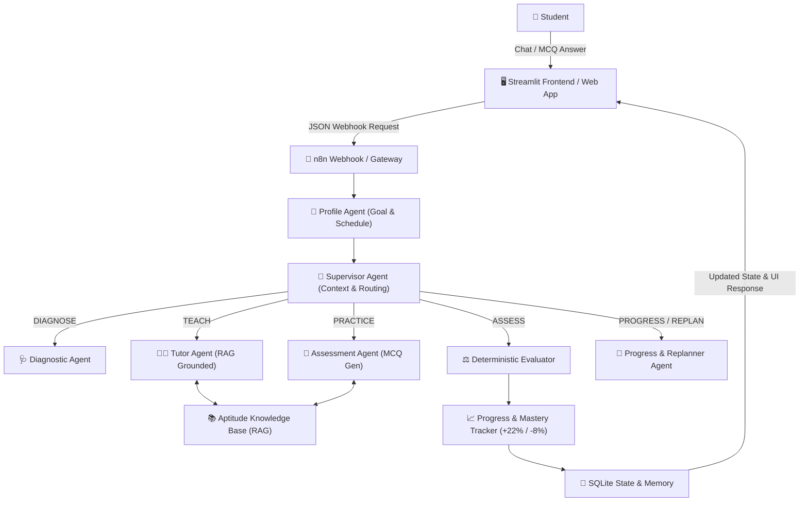

# StudyCrafter — Multi-Agent Personalized Aptitude Tutor

**StudyCrafter** is an Agentic AI personalized aptitude tutoring platform designed to help students crack campus placement tests and competitive exams through autonomous multi-agent orchestration, Knowledge Base RAG, per-student conversation memory, interactive MCQ practice, and deterministic mastery tracking.

---

## 🏗️ Architecture Overview



---

## 🌟 Key Features

1. **Zero Setup Friction**:
   - No complex forms or manual configurations.
   - Student simply opens the app and types naturally: *"I have a placement test in 20 days and want to prepare for aptitude."*
   - Profile Agent automatically extracts goal, days remaining, and study time.
   
2. **Autonomous Supervisor Routing & Memory**:
   - Resolves follow-ups naturally: *"Give me a harder one"*, *"Explain again"*, *"Another question"* using session context and topic memory.

3. **Grounded Tutor RAG Knowledge Base**:
   - Covers 7 core topics:
     1. **Percentages**
     2. **Ratio and Proportion**
     3. **Averages**
     4. **Time and Work**
     5. **Time Speed and Distance**
     6. **Profit and Loss**
     7. **Probability**
   - Adapts teaching explanations based on mastery level (<50% Basic concepts & worked examples; 50-79% Formulas & shortcuts; ≥80% Trap avoidance & advanced tricks).

4. **Interactive MCQ Practice with Deterministic Evaluation**:
   - Assessment Agent generates multiple-choice questions with 4 options (A, B, C, D).
   - `correct_answer` is maintained internally and **never exposed to the client before grading**.
   - Student selects an answer and submits: deterministic logic checks `submitted == correct_answer` and provides instant feedback.

5. **Dynamic Mastery & Adaptive Replanning**:
   - Correct answer: **+22% Mastery**.
   - Incorrect answer: **-8% Mastery**.
   - Classifications: *Weak (<50%)*, *Developing (50-79%)*, *Strong (≥80%)*.
   - Replanner dynamically steers the student towards weaker areas.

6. **Dual Frontend Options**:
   - **Streamlit App** (`streamlit run app.py`): Clean, educational UI with sidebar dashboard, progress cards, chat stream, and MCQ cards.
   - **Modern Web App** (`python run_web.py`): High-end dark glassmorphism SPA at `http://localhost:3000`.

---

## 🚀 Quick Start

### 1. Installation
```bash
# Clone repository and navigate to folder
cd "f:/study crafter"

# Install dependencies
pip install -r requirements.txt
```

### 2. Configure Environment (.env)
```bash
# Copy example configuration
copy .env.example .env
```
Ensure your `.env` contains:
```ini
USE_N8N=false
N8N_WEBHOOK_URL=http://localhost:5678/webhook/studycrafter
```

API keys are **optional** for the local Aptitude MVP (Understand, RAG teaching, MCQs, and grading all run in Python).

### 3. Run Streamlit Application
```bash
python -m streamlit run app.py
```
Open `http://localhost:8501`. The student ID is created automatically — never type it.

### 4. Optional: n8n
1. Import `n8n/studycrafter_aptitude_workflow.json` (or the original `n8n/studycrafter_workflow.json`).
2. Activate the workflow. Webhook path: `POST /webhook/studycrafter` (or your cloud URL).
3. Set `USE_N8N=true` and `N8N_WEBHOOK_URL=...` in `.env`.
4. Restart Streamlit.

If n8n is down, the app still runs using the local orchestrator.

---

## 📂 Project Structure

```text
studycrafter/
├── app.py
├── frontend/          # Streamlit chat, MCQ, dashboard
├── backend/
│   ├── agents/        # Understand, Supervisor, Diagnose, Tutor, Assess, Progress, Replan
│   ├── tools/         # knowledge, state, assessment, deterministic evaluation
│   ├── rag/           # ingest + retrieve existing aptitude_knowledge files
│   ├── skills/        # reusable playbooks
│   ├── memory/        # SQLite wrapper
│   ├── models/        # schemas
│   ├── orchestrator.py
│   ├── state.py
│   └── n8n_client.py
├── data/aptitude_knowledge/   # existing RAG corpus (reused)
└── n8n/               # workflow exports
```

---

## 💬 Example User Journeys

### 1. Setting Up Context
- **Student**: *"I have 15 days left for my placement test. I can study 2 hours per day."*
- **Agent**: Acknowledges goal and sets up adaptive study timeline.

### 2. Learning a Concept
- **Student**: *"Teach me Probability"*
- **Agent**: Retrieves formulas, concepts, and worked examples from RAG corpus.

### 3. Practice & Grading
- **Student**: *"Give me a practice question"*
- **Agent**: Renders interactive MCQ with 4 options.
- **Student**: Selects Option **B** and clicks **Submit**.
- **Agent**: Evaluates deterministically, displays feedback, and updates mastery (+22%).

### 4. Adaptive Follow-up
- **Student**: *"Give me a harder one"*
- **Agent**: Automatically uses remembered topic (*Probability*) and generates higher difficulty problem.

### Demo script
1. `I have an aptitude test in 7 days. I can study 2 hours daily. I am weak in percentages and probability.`
2. Submit the diagnostic MCQ.
3. `Explain percentages again.`
4. `Give me a practice question.`
5. Submit an answer.
6. `Show my progress.`

---

## Limitations
- Local MVP grades from a fixed Aptitude MCQ bank (not LLM-authored questions).
- RAG is the existing topic `.txt` files (keyword/topic retrieval, not Chroma embeddings).
- n8n workflow covers Understand + Supervisor routing; Teach/Practice/Evaluate still run in Python for correctness.
- Mastery starts at 0 until the student answers questions (no fake scores).
- Aptitude only — no other academic subjects.

## License
For educational and demonstration purposes.
